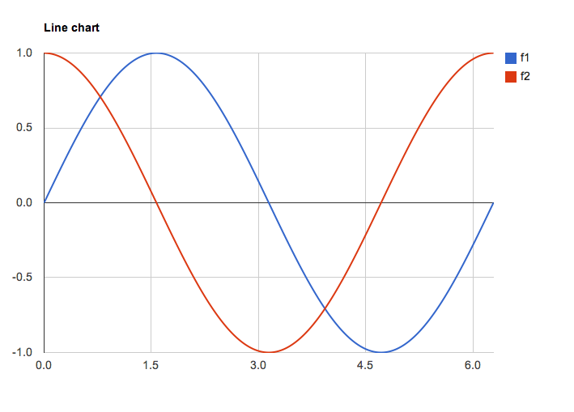

## Package to bring `sympy` functionality into `julia` via `PyCall`

The `SymPy` package  (`http://sympy.org/`)  is a Python library for symbolic mathematics. 

With the `PyCall` package of `julia`, one has access to the many features of `SymPy`. 

This `SymPy` package provides a light interface for some of the features of `SymPy` that makes working with `SymPy` objects a bit easier.

To use it, both `Python` and the `SymPy` package must be installed on your system.


## The `PyCall` interface to `SymPy`

Using `PyCall` to access `SymPy` is somewhat cumbersome. The following is how one would define a symbolic value `x`, take its sine, then evaluate at `pi`, say:

```
using PyCall
@pyimport sympy
x = sympy[:Symbol]("x")
y = sympy[:sin](x)
y[:subs](x, pi) | float
```

The `Symbol` and `sin` methods of the `sympy` object are used in the first two lines. The use of `[:Symbol]` replaces the dot notation, `sympy.Symbol` of `Python`. The `subs` method of the `y` object is called similarly, but with a the `PyObject` instance `y`. We convert this into a `Real` number from the `PyObject` value returned by the `:subs` method.


Even more cumbersome is the simple task of finding `2x`. As this multiplication is done at the python level and is not a method of `sympy` or the `x` object, we need to evaluate python code. Here is one solution:

```
x = sympy[:Symbol]("x")
pyeval("k*x", {:k=>2, :x=>x})
```

This gets replaced by a more natural syntax:

```
using SymPy
x = sym"x"			# or Sym("x") or Sym(:x)
y = sin(x)
subs(y, x, pi)
```

The object `x` we create is of type `Sym`, a simple proxy for the underlying `PyObject`. We then overload the familiar math functions so that working with symbolic expressions can use natural `julia` language. For example, to find `2x` we just use:

```
y = 2x				# assuming x is Sym instance
```

The `PyCall` interface is needed for serious work as only a small portion of the `SymPy` interface is exposed.  To dig the `PyObject` out of a `Sym` object, you access its property `x`, as in `y.x`. This is necessary if passing a `Sym` object to a method call.

## Examples

To make a symbolic object (of type `Sym`) we have the `Sym` constructor and the convenient `sym` macro:

```
x = Sym("x")
h, y = Sym("h", :y)
```

Operator overloading of the basic math functions allows symbolic expressions to be combined without fuss:

```
1/x + 1/x^2 + x			# pretty prints x + 1/x + 1/x^2
```


The `together` functions combines terms:

```
together(1/x + 1/x^2 + x)	# (x^3 + x + 1) / x^2
```

The `expand` function breaks them up;

```
expand( (x + 1)*(x+2) )		# x^2 + 3 * x + 2
```

The `apart` function does partial fraction decomposition:

```
apart(1/(x +2)/(x + 1))		# -1/(x+2) + 1/(x+1)
```


The `subs` command is used to substitute values. These values are typically numeric, though they may be other symbols:

```
subs(x + y, x, 3)		# y + 3
subs(x*y, y,  24 - 2x) 		# x⋅(-2⋅x + 24)
```

### Plotting

Plotting is done with the `GoogleCharts` package. This is temporary
while other plotting interfaces stabilize. We can plot expressions or
vectors of expressions:

```
plot(exp(-x) * sin(x), 0, 2pi)	# opens plot in browser
plot( [sin(x), diff(sin(x), x) ], 0, 2pi)
```


The key to this is forming a function object from the `Sym` object.
Here is one pattern to do so where we need to be careful to match the
variable we substitute with (`x`) with the expression.

```
u -> n(subs( exp(-x) * sin(x), x, u)) # anonymous function to evaluate expression
```

This can be done with the unexported, `as_function` function:

```
g1 = as_function(exp(-x) * sin(x))
```


</img>

### Calculus

The `limit` function computes simple limits:

```
limit(sin(x  )/x, x, 0)		# 1
limit(sin(y*x)/x, x, 0)		# y
limit(sin(y*x)/x, y, 0) 	# 0
```

One can take limits at infinity using `oo` (but not `Inf`):

```
limit(sin(x)/x, x, Inf)		# ERRORS!
limit(sin(x)/x, x, oo)		# 0
```

Derivatives, higher-order derivatives and partial derivatives are all computed by `diff`. 

```
diff(sin(x*y), x)		# y⋅cos(x⋅y)         (first derivative, y as constant)
diff(sin(x*y), x, 2)		# -y^2 * sin(x⋅y)    (second derivative in x)
diff(sin(x*y), x, y)		# -x * y * sin(x * y) + cos(x * y)  (mixed partials)
```


Integration is done through `integrate`. Both definite and indefinite integrals are possible:

```
integrate(x^2, x)		# x^3/3  (no constant term)
integrate(x^2, x, 0, 1)		# 1/3    (catching up to Archimedes)
```

One can iterate integrations to do double integrals via Fubini's theorem:

```
integrate(integrate(x*y, x, 0, 1), y, 0, 1) # 1/4
```

The calling pattern above is actually a convenience not provided by `SymPy` which actually uses a tuple to specify the variable to integrate over and the limits:

```
integrate(x^2, (x, 0, 1))	# 1/3
```


For simple integrals this syle is an extra pair of parentheses, but for multiple integrals it is much more convenient:

```
integrate(x*y, (x, 0, 1), (y, 0, 1)) # still 1/4
```

As well, the inner limits can be expressed using outer variables:
```
integrate(x*y, (x, 0, y), (y, 0,1)) # 1/8
```


Summations can be done through the `summation` function:

```
summation(1/x, (x, 1, 10))	# 7381 / 2520
summation(1/x, (x, 1, oo))      # zoo
summation(1/x^2, (x, 1, oo))	# pi^2/6
```

Taylor Series can be found through the `series` function

```
series(cos(x), x, 0, 3)		# 1 - x^2/2 + O(x^3)  (around 0, of order 3)
```

These could also be generated through the `diff` function:

```
[diff(cos(y), y, i)/factorial(i)*x^i for i in 0:3] | sum | u -> subs(u, y, 0)
```

The `solve` function can solve equations.

```
solve(x^2 - 2, x)		# an Any array of PyObject's
```

The output is not simplified. In this case, we can apply `convert` to convert the values to `Real`:

```
[convert(Real, u) for u in solve(x^2 - 2, x)] # or map(float, solve(x^2 - 2, x))
```

Differential equations can be solved with `dsolve`. Here we solve *f'(x) + f(x) = 0*. To do so, we need to create a `Function` object. As that keyword is reserved, we call the constructor `SymFunction`:

```
f = SymFunction("f")
eq = diff(f(x), x) + f(x)
dsolve(eq, f(x))		# c1 * exp(-x) as a function object
```	     

Solving *f''(x) + f(x) = 0* is similar, we just take a second derivative

```
eq = diff(f(x), x, 2) + f(x)
dsolve(eq, f(x))		# c1 * sin(x) + c2 * cos(x)
```


The `sympy` package has much more functionality than indicated here. For example, there is a lot of functionality related to polynomials and matrices we haven't exposed. For matrices, we can still do some things -- it is just a bit cumbersome. We have a constructor, but none of the methods (though these can easily be added if they seem useful). So to find a determinant of a symbolic matrix can be done, but a bit awkwardly:

```
m = SymMatrix([1 x; x 1])	# a matrix
m[:det]()			# a PyObject with the polynomial -x^2 + 1
Sym(m[:det]())			# make a sym object so that we can call:
solve(Sym(m[:det]()), x)	# an Any Array of PyObjects
map(float, solve(Sym(m[:det]()) , x))      # converts to {-1.0, 1.0}
```


